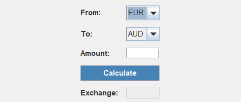

# Money Calculator

## Descripción
Money Calculator es una aplicación que permite a los usuarios convertir cantidades de dinero entre diferentes monedas utilizando tasas de cambio simuladas. La aplicación está diseñada para ser fácil de usar y proporciona resultados precisos basados en las tasas de cambio actuales.

## Características
- Conversión de dinero entre múltiples monedas.
- Interfaz de usuario intuitiva y fácil de usar.
- Tasas de cambio simuladas para pruebas y demostraciones.
- Soporte para múltiples monedas.

  ## Monedas utilizadas
- **Euro (EUR)**: €
- **Dólar estadounidense (USD)**: $
- **Libra esterlina (GBP)**: £
- **Yen japonés (JPY)**: ¥
- **Dólar canadiense (CAD)**: C$
- **Dólar australiano (AUD)**: A$

  ## Diseño de la interfaz

## Arquitectura Model-View-Controller (MVC)

La arquitectura Model-View-Controller (MVC) es un patrón de diseño que separa la aplicación en tres componentes principales: el modelo, la vista y el controlador. Esta separación facilita la gestión del código, mejora la escalabilidad y permite un desarrollo más organizado y mantenible.

### Model
Contiene las clases que representan los datos y la lógica de negocio, como `Currency`, `CurrencySet`, `Exchange`, `ExchangeRate` y `Money`.

### View
Contiene las clases que gestionan la interfaz de usuario, como `MainUI` y `MoneyResultField`.

### Controller
Contiene las clases que gestionan la lógica de control y la interacción entre el modelo y la vista, como `CalculateMoneyCommand`, `UserSelectedExchange` y `ExchangeRateSomeSourceReader`.

